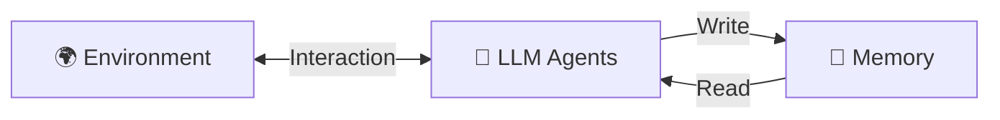
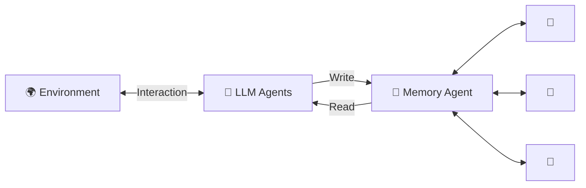
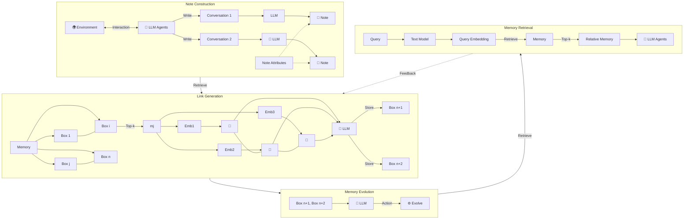

# Mermaid Diagrams - Recreated from Figure Images

## 1. Traditional Memory System (intro-a.jpg)

**Traditional Memory System:**
- Environment interacts bidirectionally with LLM Agents
- LLM Agents write to Memory (simple storage)
- LLM Agents read from Memory (simple retrieval)
- Memory is passive (just stores data)

---

## 2. Agentic Memory System (intro-b.jpg)

**Agentic Memory System:**
- Environment interacts bidirectionally with LLM Agents
- LLM Agents write to Agentic Memory
- Agentic Memory reads back to LLM Agents
- **Key Difference**: Inside Agentic Memory, there's an active Memory Agent that:
  - Manages individual memories
  - Creates bidirectional relationships between memories
  - Actively organizes and evolves memories

---

## 3. Complete Agentic Memory Framework (framework.jpg)

**Complete Framework Breakdown:**

### **Part 1: Note Construction**
- Environment interacts with LLM Agents
- Conversations are processed by LLM
- LLM generates Notes with structured attributes:
  - Timestamp
  - Content
  - Context
  - Keywords
  - Tags
  - Embedding

### **Part 2: Link Generation**
- Memory is organized into Boxes (1 to n)
- Top-k similar memories are retrieved
- Embeddings compare memories
- LLM analyzes relationships
- New memories stored in new boxes (n+1, n+2)

### **Part 3: Memory Evolution**
- Memories evolve through LLM analysis
- Actions are taken to improve memory organization
- Memories are continuously refined

### **Part 4: Memory Retrieval**
- User Query → Text Model → Query Embedding
- Retrieve from Memory (Top-k)
- Return Relative Memory (1st, 2nd, etc.)
- Provide to LLM Agents

**Flow:**
Note Construction → Link Generation → Memory Evolution → Memory Retrieval
